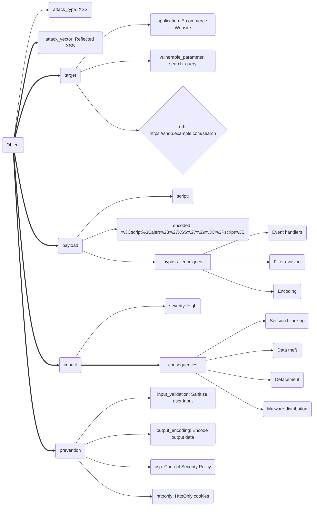

```mermaid
graph LR
root("Object")
root --> root_attack_type
root_attack_type("attack_type: XSS")
root ==> root_attack_vector
root_attack_vector("attack_vector: Reflected XSS")
root ==> root_target
root_target("target")
root_target --> root_target_application
root_target_application("application: E-commerce Website")
root_target --> root_target_vulnerable_parameter
root_target_vulnerable_parameter("vulnerable_parameter: search_query")
root_target --> root_target_url
root_target_url{"url: https://shop.example.com/search"}
root ==> root_payload
root_payload("payload")
root_payload --> root_payload_script
root_payload_script("script: <script>alert(XSS)</script>")
root_payload --> root_payload_encoded
root_payload_encoded("encoded: %3Cscript%3Ealert%28%27XSS%27%29%3C%2Fscript%3E")
root_payload --> root_payload_bypass_techniques
root_payload_bypass_techniques["bypass_techniques"]
root_payload_bypass_techniques --> root_payload_bypass_techniques_item0
root_payload_bypass_techniques_item0("Event handlers")
root_payload_bypass_techniques --> root_payload_bypass_techniques_item1
root_payload_bypass_techniques_item1("Filter evasion")
root_payload_bypass_techniques --> root_payload_bypass_techniques_item2
root_payload_bypass_techniques_item2("Encoding")
root ==> root_impact
root_impact("impact")
root_impact --> root_impact_severity
root_impact_severity("severity: High")
root_impact ==> root_impact_consequences
root_impact_consequences["consequences"]
root_impact_consequences --> root_impact_consequences_item0
root_impact_consequences_item0("Session hijacking")
root_impact_consequences --> root_impact_consequences_item1
root_impact_consequences_item1("Data theft")
root_impact_consequences --> root_impact_consequences_item2
root_impact_consequences_item2("Defacement")
root_impact_consequences --> root_impact_consequences_item3
root_impact_consequences_item3("Malware distribution")
root ==> root_prevention
root_prevention("prevention")
root_prevention --> root_prevention_input_validation
root_prevention_input_validation("input_validation: Sanitize user input")
root_prevention --> root_prevention_output_encoding
root_prevention_output_encoding("output_encoding: Encode output data")
root_prevention --> root_prevention_csp
root_prevention_csp("csp: Content Security Policy")
root_prevention --> root_prevention_httponly
root_prevention_httponly("httponly: HttpOnly cookies")
```
