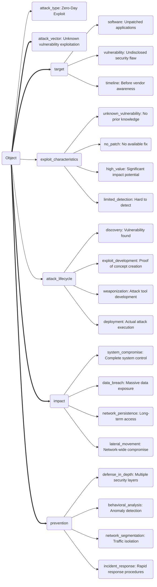

```mermaid
graph LR
root("Object")
root --> root_attack_type
root_attack_type("attack_type: Zero-Day Exploit")
root ==> root_attack_vector
root_attack_vector("attack_vector: Unknown vulnerability exploitation")
root ==> root_target
root_target("target")
root_target --> root_target_software
root_target_software("software: Unpatched applications")
root_target --> root_target_vulnerability
root_target_vulnerability("vulnerability: Undisclosed security flaw")
root_target --> root_target_timeline
root_target_timeline("timeline: Before vendor awareness")
root --> root_exploit_characteristics
root_exploit_characteristics("exploit_characteristics")
root_exploit_characteristics --> root_exploit_characteristics_unknown_vulnerability
root_exploit_characteristics_unknown_vulnerability("unknown_vulnerability: No prior knowledge")
root_exploit_characteristics --> root_exploit_characteristics_no_patch
root_exploit_characteristics_no_patch("no_patch: No available fix")
root_exploit_characteristics --> root_exploit_characteristics_high_value
root_exploit_characteristics_high_value("high_value: Significant impact potential")
root_exploit_characteristics --> root_exploit_characteristics_limited_detection
root_exploit_characteristics_limited_detection("limited_detection: Hard to detect")
root --> root_attack_lifecycle
root_attack_lifecycle("attack_lifecycle")
root_attack_lifecycle --> root_attack_lifecycle_discovery
root_attack_lifecycle_discovery("discovery: Vulnerability found")
root_attack_lifecycle --> root_attack_lifecycle_exploit_development
root_attack_lifecycle_exploit_development("exploit_development: Proof of concept creation")
root_attack_lifecycle --> root_attack_lifecycle_weaponization
root_attack_lifecycle_weaponization("weaponization: Attack tool development")
root_attack_lifecycle --> root_attack_lifecycle_deployment
root_attack_lifecycle_deployment("deployment: Actual attack execution")
root ==> root_impact
root_impact("impact")
root_impact --> root_impact_system_compromise
root_impact_system_compromise("system_compromise: Complete system control")
root_impact --> root_impact_data_breach
root_impact_data_breach("data_breach: Massive data exposure")
root_impact --> root_impact_network_persistence
root_impact_network_persistence("network_persistence: Long-term access")
root_impact --> root_impact_lateral_movement
root_impact_lateral_movement("lateral_movement: Network-wide compromise")
root ==> root_prevention
root_prevention("prevention")
root_prevention --> root_prevention_defense_in_depth
root_prevention_defense_in_depth("defense_in_depth: Multiple security layers")
root_prevention --> root_prevention_behavioral_analysis
root_prevention_behavioral_analysis("behavioral_analysis: Anomaly detection")
root_prevention --> root_prevention_network_segmentation
root_prevention_network_segmentation("network_segmentation: Traffic isolation")
root_prevention --> root_prevention_incident_response
root_prevention_incident_response("incident_response: Rapid response procedures")
```
