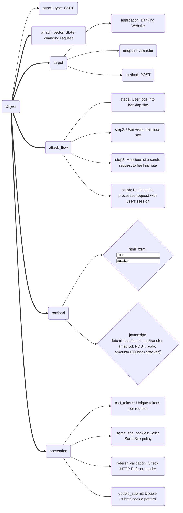

```mermaid
graph LR
root("Object")
root --> root_attack_type
root_attack_type("attack_type: CSRF")
root ==> root_attack_vector
root_attack_vector("attack_vector: State-changing request")
root ==> root_target
root_target("target")
root_target --> root_target_application
root_target_application("application: Banking Website")
root_target --> root_target_endpoint
root_target_endpoint("endpoint: /transfer")
root_target --> root_target_method
root_target_method("method: POST")
root ==> root_attack_flow
root_attack_flow("attack_flow")
root_attack_flow --> root_attack_flow_step1
root_attack_flow_step1("step1: User logs into banking site")
root_attack_flow --> root_attack_flow_step2
root_attack_flow_step2("step2: User visits malicious site")
root_attack_flow --> root_attack_flow_step3
root_attack_flow_step3("step3: Malicious site sends request to banking site")
root_attack_flow --> root_attack_flow_step4
root_attack_flow_step4("step4: Banking site processes request with users session")
root ==> root_payload
root_payload("payload")
root_payload --> root_payload_html_form
root_payload_html_form{"html_form: <form action=https://bank.com/transfer method=POST><input name=amount value=1000><input name=to value=attacker></form>"}
root_payload --> root_payload_javascript
root_payload_javascript{"javascript: fetch(https://bank.com/transfer, {method: POST, body: amount=1000&to=attacker})"}
root ==> root_prevention
root_prevention("prevention")
root_prevention --> root_prevention_csrf_tokens
root_prevention_csrf_tokens("csrf_tokens: Unique tokens per request")
root_prevention --> root_prevention_same_site_cookies
root_prevention_same_site_cookies("same_site_cookies: Strict SameSite policy")
root_prevention --> root_prevention_referer_validation
root_prevention_referer_validation("referer_validation: Check HTTP Referer header")
root_prevention --> root_prevention_double_submit
root_prevention_double_submit("double_submit: Double submit cookie pattern")
```
