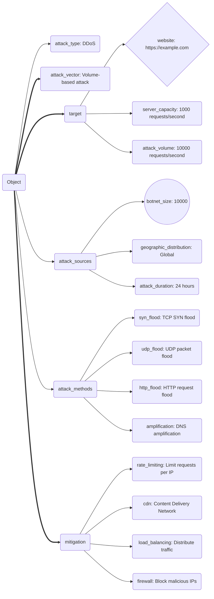

```mermaid
graph LR
root("Object")
root --> root_attack_type
root_attack_type("attack_type: DDoS")
root ==> root_attack_vector
root_attack_vector("attack_vector: Volume-based attack")
root ==> root_target
root_target("target")
root_target --> root_target_website
root_target_website{"website: https://example.com"}
root_target --> root_target_server_capacity
root_target_server_capacity("server_capacity: 1000 requests/second")
root_target --> root_target_attack_volume
root_target_attack_volume("attack_volume: 10000 requests/second")
root --> root_attack_sources
root_attack_sources("attack_sources")
root_attack_sources --> root_attack_sources_botnet_size
root_attack_sources_botnet_size(("botnet_size: 10000"))
root_attack_sources --> root_attack_sources_geographic_distribution
root_attack_sources_geographic_distribution("geographic_distribution: Global")
root_attack_sources --> root_attack_sources_attack_duration
root_attack_sources_attack_duration("attack_duration: 24 hours")
root --> root_attack_methods
root_attack_methods("attack_methods")
root_attack_methods --> root_attack_methods_syn_flood
root_attack_methods_syn_flood("syn_flood: TCP SYN flood")
root_attack_methods --> root_attack_methods_udp_flood
root_attack_methods_udp_flood("udp_flood: UDP packet flood")
root_attack_methods --> root_attack_methods_http_flood
root_attack_methods_http_flood("http_flood: HTTP request flood")
root_attack_methods --> root_attack_methods_amplification
root_attack_methods_amplification("amplification: DNS amplification")
root ==> root_mitigation
root_mitigation("mitigation")
root_mitigation --> root_mitigation_rate_limiting
root_mitigation_rate_limiting("rate_limiting: Limit requests per IP")
root_mitigation --> root_mitigation_cdn
root_mitigation_cdn("cdn: Content Delivery Network")
root_mitigation --> root_mitigation_load_balancing
root_mitigation_load_balancing("load_balancing: Distribute traffic")
root_mitigation --> root_mitigation_firewall
root_mitigation_firewall("firewall: Block malicious IPs")
```
