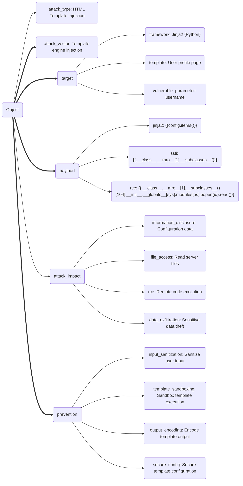

```mermaid
graph LR
root("Object")
root --> root_attack_type
root_attack_type("attack_type: HTML Template Injection")
root ==> root_attack_vector
root_attack_vector("attack_vector: Template engine injection")
root ==> root_target
root_target("target")
root_target --> root_target_framework
root_target_framework("framework: Jinja2 (Python)")
root_target --> root_target_template
root_target_template("template: User profile page")
root_target --> root_target_vulnerable_parameter
root_target_vulnerable_parameter("vulnerable_parameter: username")
root ==> root_payload
root_payload("payload")
root_payload --> root_payload_jinja2
root_payload_jinja2("jinja2: {{config.items()}}")
root_payload --> root_payload_ssti
root_payload_ssti("ssti: {{.__class__.__mro__[1].__subclasses__()}}")
root_payload --> root_payload_rce
root_payload_rce("rce: {{.__class__.__mro__[1].__subclasses__()[104].__init__.__globals__[sys].modules[os].popen(id).read()}}")
root --> root_attack_impact
root_attack_impact("attack_impact")
root_attack_impact --> root_attack_impact_information_disclosure
root_attack_impact_information_disclosure("information_disclosure: Configuration data")
root_attack_impact --> root_attack_impact_file_access
root_attack_impact_file_access("file_access: Read server files")
root_attack_impact --> root_attack_impact_rce
root_attack_impact_rce("rce: Remote code execution")
root_attack_impact --> root_attack_impact_data_exfiltration
root_attack_impact_data_exfiltration("data_exfiltration: Sensitive data theft")
root ==> root_prevention
root_prevention("prevention")
root_prevention --> root_prevention_input_sanitization
root_prevention_input_sanitization("input_sanitization: Sanitize user input")
root_prevention --> root_prevention_template_sandboxing
root_prevention_template_sandboxing("template_sandboxing: Sandbox template execution")
root_prevention --> root_prevention_output_encoding
root_prevention_output_encoding("output_encoding: Encode template output")
root_prevention --> root_prevention_secure_config
root_prevention_secure_config("secure_config: Secure template configuration")
```
