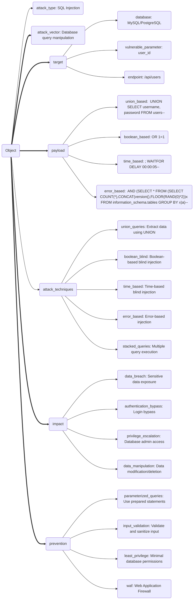

```mermaid
graph LR
root("Object")
root --> root_attack_type
root_attack_type("attack_type: SQL Injection")
root ==> root_attack_vector
root_attack_vector("attack_vector: Database query manipulation")
root ==> root_target
root_target("target")
root_target --> root_target_database
root_target_database("database: MySQL/PostgreSQL")
root_target --> root_target_vulnerable_parameter
root_target_vulnerable_parameter("vulnerable_parameter: user_id")
root_target --> root_target_endpoint
root_target_endpoint("endpoint: /api/users")
root ==> root_payload
root_payload("payload")
root_payload --> root_payload_union_based
root_payload_union_based("union_based:  UNION SELECT username, password FROM users--")
root_payload --> root_payload_boolean_based
root_payload_boolean_based("boolean_based:  OR 1=1")
root_payload --> root_payload_time_based
root_payload_time_based("time_based: ; WAITFOR DELAY 00:00:05--")
root_payload --> root_payload_error_based
root_payload_error_based("error_based:  AND (SELECT * FROM (SELECT COUNT(*),CONCAT(version(),FLOOR(RAND(0)*2))x FROM information_schema.tables GROUP BY x)a)--")
root --> root_attack_techniques
root_attack_techniques("attack_techniques")
root_attack_techniques --> root_attack_techniques_union_queries
root_attack_techniques_union_queries("union_queries: Extract data using UNION")
root_attack_techniques --> root_attack_techniques_boolean_blind
root_attack_techniques_boolean_blind("boolean_blind: Boolean-based blind injection")
root_attack_techniques --> root_attack_techniques_time_based
root_attack_techniques_time_based("time_based: Time-based blind injection")
root_attack_techniques --> root_attack_techniques_error_based
root_attack_techniques_error_based("error_based: Error-based injection")
root_attack_techniques --> root_attack_techniques_stacked_queries
root_attack_techniques_stacked_queries("stacked_queries: Multiple query execution")
root ==> root_impact
root_impact("impact")
root_impact --> root_impact_data_breach
root_impact_data_breach("data_breach: Sensitive data exposure")
root_impact --> root_impact_authentication_bypass
root_impact_authentication_bypass("authentication_bypass: Login bypass")
root_impact --> root_impact_privilege_escalation
root_impact_privilege_escalation("privilege_escalation: Database admin access")
root_impact --> root_impact_data_manipulation
root_impact_data_manipulation("data_manipulation: Data modification/deletion")
root ==> root_prevention
root_prevention("prevention")
root_prevention --> root_prevention_parameterized_queries
root_prevention_parameterized_queries("parameterized_queries: Use prepared statements")
root_prevention --> root_prevention_input_validation
root_prevention_input_validation("input_validation: Validate and sanitize input")
root_prevention --> root_prevention_least_privilege
root_prevention_least_privilege("least_privilege: Minimal database permissions")
root_prevention --> root_prevention_waf
root_prevention_waf("waf: Web Application Firewall")
```
